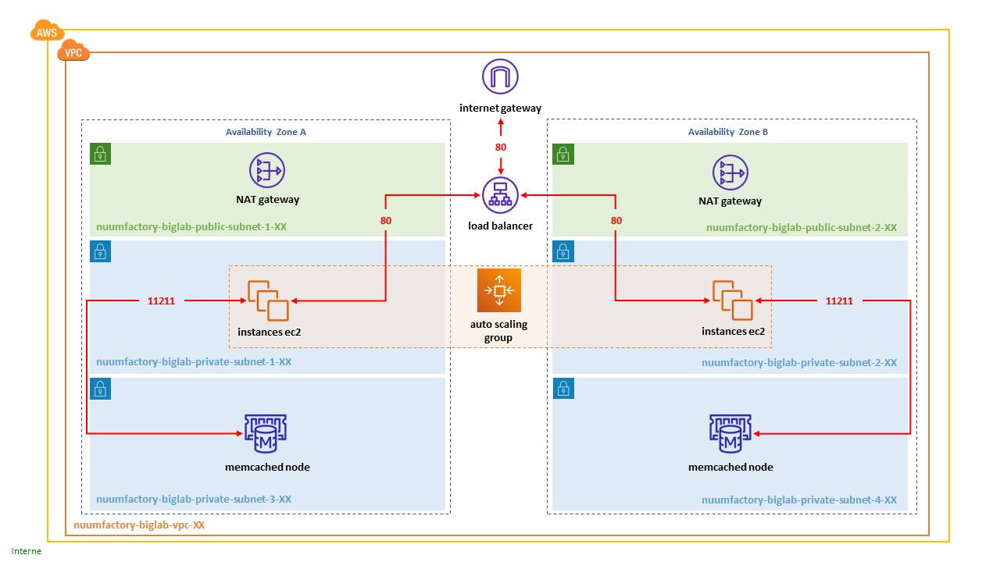

# CREATION D'UNE INFRASTRUCTURE COMPLEXE AVEC TERRAFORM

**Sommaire**

Introduction  
[1. Création de l'infrastructure](pages/partie-1.md)  
[2. Test de l'application](pages/partie-2.md)   

## Introduction

L'objectif de ce lab est de créer une infrastructure complexe sur AWS avec **Terraform**.

### L'infrastructure

L'architecture de l'infrastructure est la suivante :

Dans cette architecture, nous retrouvons les éléments suivants :

- Un VPC hébergé dans une région qui vous sera attribuée
- 2 sous-réseaux publics répartis dans les availability zone A et B
- 4 sous-réseaux privés répartis dans les availability zone A et B
- Une internet gateway pour gérer le traffic entre l'extérieur et les sous-réseaux publics
- Une NAT gateway dans chaque sous-réseau public pour gérer les flux sortants des sous-réseaux privés 1 et 2
- Un load-balancer pour répartir les requêtes HTTP en provenance de l'extérieur vers les instances EC2 de l'auto-scaling group
- Un auto-scaling group dont les instances EC2 qui hébergent l'application web sont réparties sur les sous-réseaux privés 1 et 2.
- Un cluster memcached pour la gestion des sessions utilisateurs, composé de 2 noeuds répartis sur les sous-réseaux privés 3 et 4.

Cette architecture hébergera une application web basique qui sera installée sur les serveurs au travers d'user datas.

Vous trouverez ci-dessous les **régions** et **adresses de sous-réseaux** que vous devrez utiliser :

| NOM                   | PRENOM          | REGION       | VPC          | PUBLIC SUBNET 1 | PUBLIC SUBNET 2 | PRIVATE SUBNET 1 | PRIVATE SUBNET 2 | PRIVATE SUBNET 3 | PRIVATE SUBNET 4 |
|-----------------------|-----------------|--------------|--------------|-----------------|-----------------|------------------|------------------|------------------|------------------|
| AIT   BARA            | Abdelatif       | eu-west-1    | 30.0.0.0/16  | 30.0.1.0/24     | 30.0.2.0/24     | 30.0.3.0/24      | 30.0.4.0/24      | 30.0.5.0/24      | 30.0.6.0/24      |
| ANTONYAN              | Tigran          | eu-west-1    | 40.0.0.0/16  | 40.0.1.0/24     | 40.0.2.0/24     | 40.0.3.0/24      | 40.0.4.0/24      | 40.0.5.0/24      | 40.0.6.0/24      |
| BEN   AHMED           | Yousri          | eu-west-2    | 50.0.0.0/16  | 50.0.1.0/24     | 50.0.2.0/24     | 50.0.3.0/24      | 50.0.4.0/24      | 50.0.5.0/24      | 50.0.6.0/24      |
| BEN   HAMIDA          | Yacine          | eu-west-2    | 60.0.0.0/16  | 60.0.1.0/24     | 60.0.2.0/24     | 60.0.3.0/24      | 60.0.4.0/24      | 60.0.5.0/24      | 60.0.6.0/24      |
| BENKHEIRA             | Yousra          | eu-central-1 | 70.0.0.0/16  | 70.0.1.0/24     | 70.0.2.0/24     | 70.0.3.0/24      | 70.0.4.0/24      | 70.0.5.0/24      | 70.0.6.0/24      |
| BILLERACH             | Kevin           | eu-central-1 | 80.0.0.0/16  | 80.0.1.0/24     | 80.0.2.0/24     | 80.0.3.0/24      | 80.0.4.0/24      | 80.0.5.0/24      | 80.0.6.0/24      |
| CHAABANI              | Haythem         | eu-north-1   | 90.0.0.0/16  | 90.0.1.0/24     | 90.0.2.0/24     | 90.0.3.0/24      | 90.0.4.0/24      | 90.0.5.0/24      | 90.0.6.0/24      |
| DOS   SANTOS FERREIRA | Jorge           | eu-north-1   | 100.0.0.0/16 | 100.0.1.0/24    | 100.0.2.0/24    | 100.0.3.0/24     | 100.0.4.0/24     | 100.0.5.0/24     | 100.0.6.0/24     |
| DUFETRE               | Christophe      | ca-central-1 | 110.0.0.0/16 | 110.0.1.0/24    | 110.0.2.0/24    | 110.0.3.0/24     | 110.0.4.0/24     | 110.0.5.0/24     | 110.0.6.0/24     |
| HAIDARI               | Nassim          | ca-central-1 | 120.0.0.0/16 | 120.0.1.0/24    | 120.0.2.0/24    | 120.0.3.0/24     | 120.0.4.0/24     | 120.0.5.0/24     | 120.0.6.0/24     |
| HASSAN                | Hadi            | us-east-1    | 130.0.0.0/16 | 130.0.1.0/24    | 130.0.2.0/24    | 130.0.3.0/24     | 130.0.4.0/24     | 130.0.5.0/24     | 130.0.6.0/24     |
| KAMELI                | Karim           | us-east-1    | 140.0.0.0/16 | 140.0.1.0/24    | 140.0.2.0/24    | 140.0.3.0/24     | 140.0.4.0/24     | 140.0.5.0/24     | 140.0.6.0/24     |
| LINDOU                | Arouna          | ap-south-1   | 150.0.0.0/16 | 150.0.1.0/24    | 150.0.2.0/24    | 150.0.3.0/24     | 150.0.4.0/24     | 150.0.5.0/24     | 150.0.6.0/24     |
| MIANTSOKO             | Giovani Destall | ap-south-1   | 160.0.0.0/16 | 160.0.1.0/24    | 160.0.2.0/24    | 160.0.3.0/24     | 160.0.4.0/24     | 160.0.5.0/24     | 160.0.6.0/24     |
| RAMDANE               | Amine           | sa-east-1    | 170.0.0.0/16 | 170.0.1.0/24    | 170.0.2.0/24    | 170.0.3.0/24     | 170.0.4.0/24     | 170.0.5.0/24     | 170.0.6.0/24     |
| SAFI                  | Choukri         | sa-east-1    | 180.0.0.0/16 | 180.0.1.0/24    | 180.0.2.0/24    | 180.0.3.0/24     | 180.0.4.0/24     | 180.0.5.0/24     | 180.0.6.0/24     |
| VALLA                 | Jonathan        | eu-west-3    | 190.0.0.0/16 | 190.0.1.0/24    | 190.0.2.0/24    | 190.0.3.0/24     | 190.0.4.0/24     | 190.0.5.0/24     | 190.0.6.0/24     |